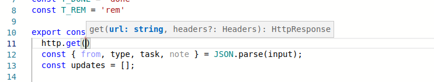

# Knockoff - now with 100% more Compute!

Knockoff is a playful TODO list demo app built to showcase Wasm-extensibility with the Suborbital Compute platform.

Compared to its younger cousin, this version is meant to showcase a full Suborbital Compute integration scenario, and while the backend is built in Node.js it actually does not use the Node.js SDK and is meant more as a showcase for general backend integration compatibility, rather than Node.js specifically (e.g. would probably run with few modifications in Deno, which would be also interesting to explore)

Highlights:

- Built largely on off-the-shelf code
- 
- Event visualization to highlight Wasm integration actions

> *"POPeen" logo by [@whoisaldeka](https://twitter.com/whoisaldeka/status/1138678402930470913)*

## How to use

Head to [knockoff.fly.dev](https://knockoff.fly.dev) where you will find the deployed app. Type and hit `enter` to add new items to your to-do list next to the 🚀 icon. The items you type are synchronized and persisted on the server (and are recovered if you reload the page).

The WebAssembly integration reacts to certain events and content and updates the todo list. The default integration:

- Appends exclamation marks to to-do items containing the word *"important"*
- Uses the [http Runnable API](https://docs.suborbital.dev/atmo/runnable-api/http-client) API to expand URLs into links that use the target page title
- Adds quips and remarks once a task is marked as done

Click into the editor in the lower left corner to make the editor window larger. You may edit this code and hit `F5` or `Ctrl|Cmd+S` to save the changes and deploy an updated Wasm integration, feel free to experiment!

The editor changes and events are persisted, and a clean slate and default runnable can be restored using the [`/reset`](https://knockoff.fly.dev/reset) endpoint.

## How to run

There is a `Dockerfile`, to run a local instance clone this repo and run `make test` (blame Connor for the makefile-ification!), or deploy to Fly.io using the `fly.toml`. Note: the default 512 MB RAM instances might fail to build the runnable (Javy likes RAM like Chrome does, it seems), [bump it](https://fly.io/docs/reference/scaling/#adjusting-a-vm-s-memory) to 1024 MB and you should be golden.

Use `make testeditor` to test the Monaco editor alone.

## The nitty-gritty

Knockoff has a UI, an Editor component and a backend that handles the Wasm extensibility and persistence API.

### The frontend

The UI is based on the [TODOMVC Vue App](https://todomvc.com/examples/vue/). The UI is actually based on one of the [petite-vue](https://github.com/vuejs/petite-vue) sample apps, which means there are no build steps involved (just edit the files in `www`), but do note that there are [certain differences compared to mainline vue](https://github.com/vuejs/petite-vue#features).

The editor component (in `editor`) embeds the [Monaco (VS Code) editor component](https://www.npmjs.com/package/monaco-editor). This is a very basic integration, but I did manage to get hotkeys (for saving/deploying) and autocomplete working.

For autocomplete I used my fork of the [JS runnable library](https://www.npmjs.com/package/@flaki/runnable) but there is nothing specific to it, I just used `tsc` to generate typings from the TypeScript code and bundle that into the editor component during build. Some loose notes about the commands are in [notes.md](docs/notes.md).

The editor component is pre-built in the Docker workflow using ESBuild, see the `Makefile` for details.

### The backend

The backend is an improved version of the [flyfun backend](https://github.com/suborbital/flyfun). It's a simple Node.js application that serves up the app UI, handles the proxying and provisioning of the `sat` instance and provides the APIs to update the shared state (todos, events and the currently deployed runnable's code).

Compared to this demo, this one adds code persistence (the Runnable code is now stored in memory and served up with the UI), but I removed the ENV vars and Debug builds support for simplicity.

In terms of the dependencies, almost every tool is now the mainline tooling sourced from published images/assets (subo, javy, sat). The JS runnable library remains the forked `@flaki/runnable` until `@suborbital/runnable` gets the `setHeader` API in a new release (although, this demo does not rely on them).

## Missing features

- **Live synchronization** - multiple users/browsers can manipulate the items at the same time and sometimes this will work but there is no live synchronization
- **Multiple event handlers** - currently a single Wasm handler is provided to manipulate todo items and events. SCN could provision unlimited event handlers that would run sequentially (or simultaneously, if required) on all new events. The backend provisions a single `sat` proxy to handle events, we could either use Atmo, multiple `sat` instances, or use the `stdin` mode to instantiate `sat` processes to implement multiple handlers in the OSS world.
- **Fixed runnable package.json** - still can't add extra dependencies (it should be trivial to add this, as we `pnpm install` anyway on every provisioning, but since there is no builder isolation this is also a potential security issue)
- **Proper events handling** - the events handling is a bit monkey-patched. I really wanted a proper event log to showcase better what happens in the "Wasm extensibility" side of things, with more time and more forethought I would at least use a proper state library (Immutable.js or similar), and perhaps this sort of use case is better fit for an Event-based system like Kafka on the Wasm side.
- **How long is this video?** - the original plan was to add [a feature I frequently use myself](https://spiffy-tuber.flaki.hu/info?id=https://www.youtube.com/watch?v=pMPKEr96zSg) that checks the length of a YouTube video and adds it to the item in my "watch later" list. The original service is written in Node.js and does this by scraping the target URL (no API calls), reimplementing it in Javy-flavour JS (or using the above JSON API to do so) is left as an exercise to the reader. :)
